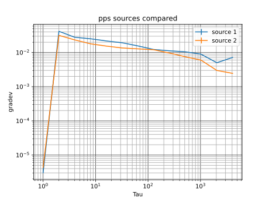

To be able to compile this, you need the pps-tools and cmake packages. libgps-dev is optional.
To run:
    sudo ./pps-comparer -1 /dev/pps0 -2 /dev/pps1 -l log.dat

Press ctrl+c to stop measuring

When you've got libgps-dev installed during build, -g <host> adds gpsd stats to the output.

If you have saved the output to e.g. test.dat (-l test.dat), you can plot the Allan deviation plot with:

    ./plot-allan.py test.dat test.svg

test.svg is then the output-graph.

For a histogram or as a time-series, use plot-hist.py and plot-ts.py.

Note: when pulses are missing(! e.g. when GPS loses fix), the comparison goes haywire.

* output:

    nr    ts1                  ts2                  difference   missing1/2 difference-drift fix hdop
    10852 1732126554.000050923 1732126554.000046496 4.427000e-06 548/88     2.783154e-10     3   1.760000
    10853 1732126555.000050482 1732126555.000044753 5.729000e-06 548/88     2.206966e-10     3   1.760000
    10854 1732126556.000049989 1732126556.000045875 4.114000e-06 548/88     3.406431e-10     3   1.760000
    ...

Released under the MIT license by Folkert van Heusden.
